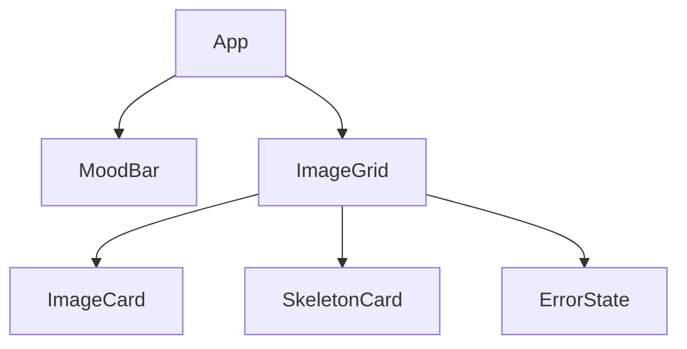

# 🏗️ ARCHITECTURE.md

## Component Tree

## Data Flow
1. **User Interaction**: User clicks a mood button in `MoodBar`.
2. **State Update**: `App` updates `selectedMood` and calls `fetchImages(mood)` from `useVibeImages`.
3. **Fetching**: `useVibeImages` sets `loading: true` and generates URLs via `buildImageUrl`.
4. **Pre-loading**: The hook creates `new Image()` instances for each URL to ensure they are cached by the browser before rendering.
5. **Render**: Once all images are pre-loaded, `images` state is updated, `loading` set to `false`, and `ImageGrid` renders `ImageCard` components.

## State Machines (FSM)
The application follows a 4-state Finite State Machine:
- **IDLE**: Waiting for first interaction.
- **LOADING**: Fetching images and pre-loading assets. (Shows `SkeletonCard`)
- **SUCCESS**: Images rendered successfully. (Shows `ImageCard`)
- **FAILURE**: Network error or empty results. (Shows `ErrorState`)

## Behaviour Guarantees
- **Deduplication**: The `useVibeImages` hook uses a `useRef` and check-blocks to prevent concurrent identical requests.
- **Consistency**: All images in a grid always belong to the same mood.
- **Responsiveness**: Grid layout adapts from 1 column (mobile) to 5 columns (desktop).

## Styling Rationale
- **Vanilla CSS**: Used for performance and maximum control over micro-animations.
- **Tokens**: Centralized variables in `global.css` ensure visual consistency (e.g., `--glass-border`, `--transition-smooth`).
